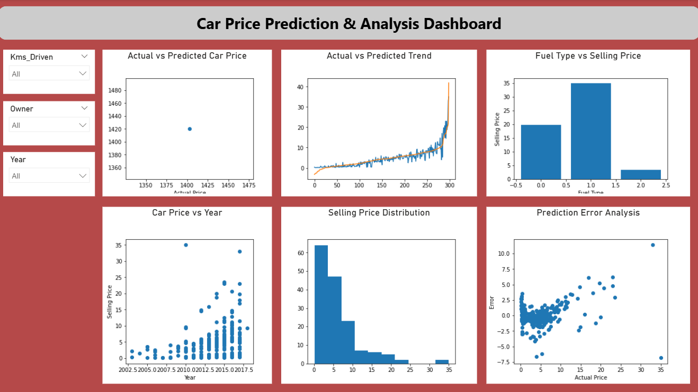

# 🚗 Car Price Prediction & Analysis Dashboard

## 📊 Project Overview

This project focuses on predicting car prices using Machine Learning and visualizing key insights through an interactive Power BI dashboard.

The model uses Linear Regression to estimate car prices based on features such as fuel type, kilometers driven, transmission, and year.


## 🎯 Objectives

* Predict car selling prices using Machine Learning
* Compare actual vs predicted values
* Analyze factors affecting car prices
* Build an interactive dashboard for insights

## 🛠 Tools & Technologies Used

* **Python** (Pandas, Scikit-learn, Matplotlib)
* **Power BI** (Dashboard & Visualization)
* **GitHub** (Project hosting)


## 📂 Dataset Information

The dataset includes the following features:

* Car_Name
* Year
* Selling_Price
* Present_Price
* Kms_Driven
* Fuel_Type
* Seller_Type
* Transmission
* Owner

## ⚙️ Machine Learning Model

* Algorithm: **Linear Regression**
* Train-Test Split: 80% training, 20% testing
* Evaluation Metric: **R² Score**


## 📈 Dashboard Features

* Actual vs Predicted Price Comparison
* Prediction Trend Analysis
* Fuel Type vs Selling Price
* Car Price vs Year
* Selling Price Distribution
* Prediction Error Analysis
* Interactive Filters (Year, Owner, Kms Driven)

## 📸 Dashboard Preview




## 📁 Project Structure
```
Car-Price-Prediction/
│── car_data.csv
│── CarPriceDashboard.pbix
│── model.py
│── dashboard.png
│── README.md
```

## 🚀 How to Run the Project

### 1. Clone Repository

```
git clone https://github.com/your-username/car-price-prediction-powerbi.git
```

### 2. Open Power BI File

* Open `.pbix` file in Power BI Desktop

### 3. Enable Python in Power BI

* Go to File → Options → Python scripting
* Set Python path

### 4. Refresh Data

* Click **Refresh** to run the Python model


## 📊 Key Insights

* Car prices increase with newer models (Year)
* Lower kilometers driven → higher selling price
* Fuel type impacts price significantly
* Model predictions closely match actual values

## 👩‍💻 Author

**Shruti Upadhyay**
